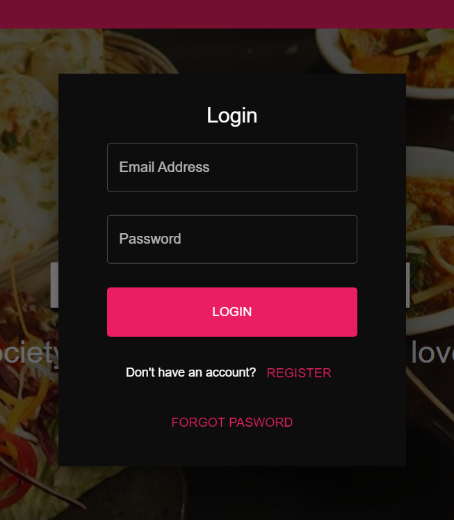
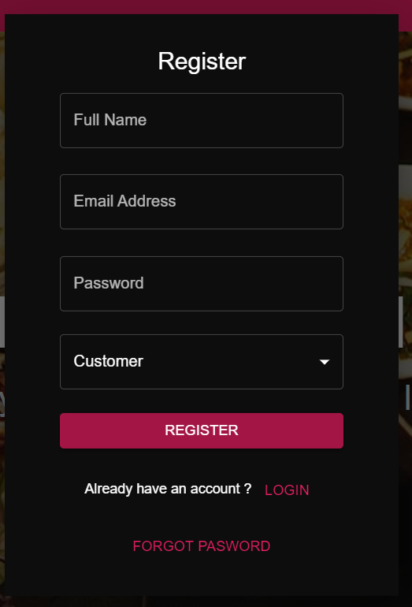
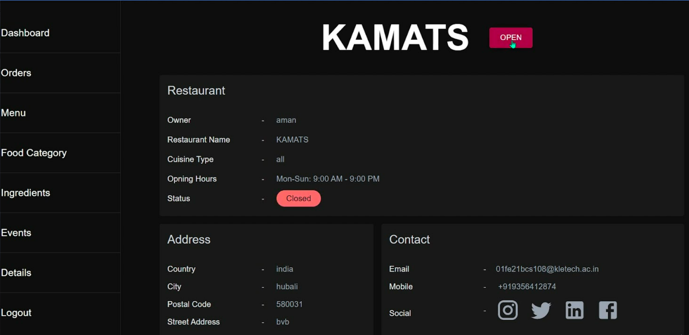

# FoodShare

## Project Description

FoodShare is an innovative platform designed to address food insecurity by connecting surplus food from hotels and restaurants with individuals who need it. The project aims to promote efficient surplus food management and sustainable consumption practices. By offering luxurious and exclusive remaining food from popular restaurants at significantly reduced prices, FoodShare ensures that high-quality food that would otherwise go to waste is made accessible to those who cannot afford it at full price.

## Features

- **Surplus Food Management**: Efficiently manage and distribute surplus food from restaurants and hotels.
- **Exclusive Food Access**: Provide affordable access to high-quality, exclusive food from renowned establishments.
- **User-Friendly Interface**: Intuitive and responsive interface built with modern web technologies.
- **Full-Stack Integration**: Comprehensive solution integrating both frontend and backend technologies.
- **Sustainable Practices**: Reduce food waste and promote sustainable consumption.

## Technologies Used

- **Frontend**: HTML, CSS, JavaScript
- **Backend**: Java, Spring Framework
- **Database**: MySQL

## Getting Started

To set up and run the FoodShare project locally, follow these instructions:

### Prerequisites

- Java Development Kit (JDK) 11 or later
- MySQL Database
- Node.js and npm (for frontend dependencies)

  ## Screenshots

### Homepage and other images
#### Hompage

#### Login Page for customer and restaurant owner

#### Customer and Restaurant registration

#### Various Restaurants

#### Restaurant Dashboard


### Installation

1. **Clone the Repository**

   ```bash
   git clone https://github.com/your-username/FoodShare.git
   cd FoodShare

2. **Set Up the Backend**

-Navigate to the backend directory:

   ```bash
   cd backend 
   ```
-Build and install dependencies using Maven:

  ```bash
  ./mvnw clean install
  ```

Configure your database settings in src/main/resources/application.properties.   

3. **Set Up the Frontend**

-Navigate to the frontend directory:

   ```bash

   cd ../frontend
   ```
-Install the necessary dependencies:

   ```bash

   npm install
   ```
4. **Run the Application**

Start the backend server:

  ```bash

  cd ../backend
  ./mvnw spring-boot:run
  ```
5. **Start the frontend development server:**

  ```bash

  cd ../frontend
  npm start
  ```
The application will be available at http://localhost:8080 (backend) and http://localhost:3000 (frontend).
### THANK YOU
#### FEEL FREE TO MAKE CONTRIBUTIONS!!!
